# iFreedmen Creative Suite Architecture

This document provides architectural diagrams for the iFreedmen Creative Suite ecosystem, showing both the infrastructure layout and development workflow.

## Infrastructure Architecture

The following diagram shows how the five repositories work together, their deployment through GitHub Pages, and domain mapping through GoDaddy DNS.

### Repository Details

- **ifreedman-com** - Flagship hub and Creative Suite entry point
- **ifreedmen-net** - Community engagement, directories, and events
- **ifreedmen-info** - Research portal with lineage guides and legal references
- **ifreedmen-shop** - Open marketplace for Freedmen entrepreneurs (Semi Nerd co-brand)
- **ifreedmen-store** - Official regalia and cultural artifacts
- **ifreedmen-api** - API gateway with health checks, identity verification, and shared backend services

## Development Workflow

The following diagram shows the development and deployment process using GitHub Copilot and automated workflows.

```mermaid
flowchart LR
    subgraph Dev ["🤖 Development"]
        Copilot["GitHub Copilot Agent"]
        Issue["GitHub Issue"]
    end

    subgraph Repo ["📂 Repository"]
        PR["Pull Request"]
        Main["Main Branch"]
        Workflow["Pages Workflow"]
    end

    subgraph Deploy ["🚀 Deployment"]
        Build["Build Process"]
        Dist["dist/ Output"]
        Pages["GitHub Pages"]
    end

    subgraph Live ["🌐 Live Site"]
        Domain["Custom Domain"]
        Site["Published Site"]
    end

    Issue --> Copilot
    Copilot --> PR
    PR -->|merge| Main
    Main --> Workflow
    Workflow --> Build
    Build --> Dist
    Dist --> Pages
    Pages --> Domain
    Domain --> Site

    style Copilot fill:#2ea043
    style Pages fill:#0969da
    style Site fill:#8250df
```

### Workflow Steps

1. **Issue Creation** - Problem or feature request is identified
2. **Copilot Agent** - Automated code generation and scaffolding
3. **Pull Request** - Code review and validation process
4. **Main Branch** - Merged changes trigger deployment
5. **Pages Workflow** - Automated build using Node.js 20
6. **Build Process** - Static site generation to `dist/` directory
7. **GitHub Pages** - Hosting and CDN distribution
8. **Custom Domain** - Domain mapping through GoDaddy DNS
9. **Live Site** - Production deployment accessible to users

## Technology Stack

- **Static Site Generation**: Next.js with static export capability
- **API Services**: Express.js with RESTful endpoints and health monitoring
- **Content Management**: Markdown with front-matter, JSON configurations
- **Deployment**: GitHub Pages with GitHub Actions
- **DNS Management**: GoDaddy with custom domain mapping
- **Development**: GitHub Copilot for automated scaffolding
- **Package Management**: npm with Node.js 20

## Repository Links

- [ifreedmen-net](https://github.com/ifreedmen/ifreedmen-net) — Community Network
- [ifreedmen-info](https://github.com/ifreedmen/ifreedmen-info) — Research & Education
- [ifreedmen-shop](https://github.com/ifreedmen/ifreedmen-shop) — Community Marketplace
- [ifreedmen-store](https://github.com/ifreedmen/ifreedmen-store) — Brand & Regalia
- [ifreedmen-api](https://github.com/ifreedmen/ifreedmen-api) — API Gateway & Services

*Note: Repository links will be active once the repositories are created using the tools in this repository.*